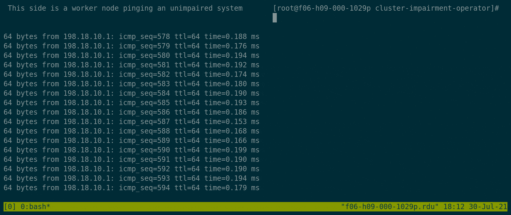
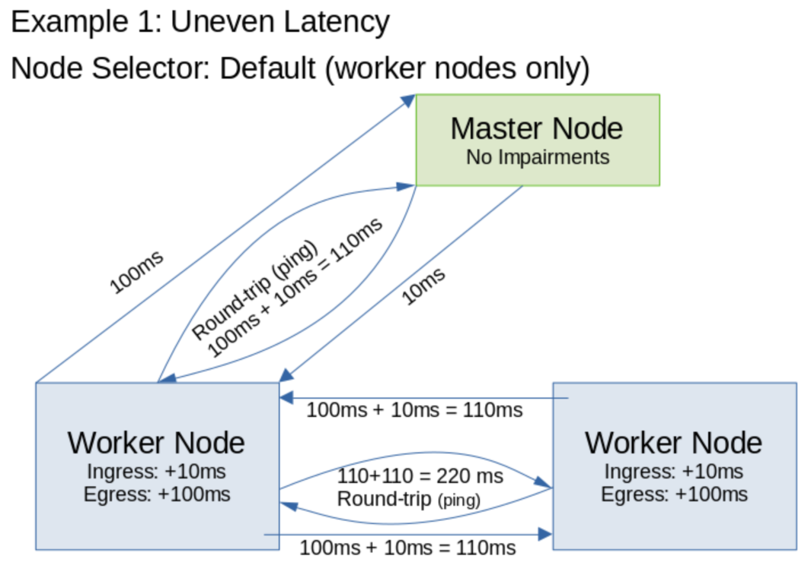

# cluster-impairment-operator

cluster-impairment-operator is an operator designed to automate the application of impairments to the nodes in a cluster.



## Features

Traffic Direction:
* Egress impairments affect the traffic going out.
* Ingress impairments affect the traffic coming in.
  *  Ingress impairments require the kernel module IFB.

### Impairments

| Impairment    | Description                                | Unit    | Uses Netem | Correlation Supported |
|---------------|--------------------------------------------|---------|------------|-----------------------|
| Bandwidth     | The bandwidth limit                        | kbit/s  | Yes        | No                    |
| Latency       | The delay of the packets                   | ms      | Yes        | Yes                   |
| Packet Loss   | The percent of packets that are dropped    | percent | Yes        | Yes                   |
| Corruption    | The percent of packets that are corrupted  | percent | Yes        | Yes                   |
| Duplication   | The percent of packets that are duplicated | percent | Yes        | Yes                   |
| Link Flapping | Turns the interface on and off             | bool    | No         | No                    |

On the tested environment (RHEL CoreOS 48.84), the impairments can be used alongside link flapping.

#### Latency Options

In addition to simply delaying the packets, there are advanced latency options.

**Jitter**

Semi-randomly adds or subtracts from the latency according to the distribution up to the amount specified.
If latency is 100ms, and jitter is 10ms, the actual latency will vary 100±10ms.


**Distribution**

The distribution of the jitter. The options are:
* Normal
* Uniform
* Pareto
* Paretonormal

**Jitter correlation**

The percent chance that the next latency's jitter value will correlate with the preceeding latency.

**Reorder**

The percentage of packets that are not delayed, causing a reorder due to them being sent before the delayed ones.
Applying jitter itself has the potential to also cause reordering.

**Reorder correlation**
 
The percet chance that the value for the next reorder will correlate with the preceeding value.

#### Loss options

**Correlation**

The percent chance that the previous loss value for a packet correlates with the loss value for the next packet.

#### Corruption options

**Corruption**

The percent chance that each packet will be corrupted.

**Corruption correlation**

The percet chance that the value for the next corruption will correlate with the preceeding value.

#### Duplication options

**Duplication**

The percent chance that each packet will be duplicated.

**Duplication correlation**

The percet chance that the value for the next duplication will correlate with the preceeding value.


## Configuration

Here is an example of the ClusterImpairment custom resource.
```yaml
apiVersion: apps.redhat.com/v1alpha1
kind: ClusterImpairment
metadata:
  name: test-impairment-cr
spec:
  duration: 30 # seconds
  startDelay: 5 # seconds. It typically takes about 2-3 seconds for the Daemonset to run
  interfaces:
  - "ens3"
  ingress: # uses ifb
    bandwidth: 0 # kbit
    latency: 10 # ms
    latencyOptions:
      jitter: 5 # ms
      jitterCorrelation: 25 # percent
      distribution: normal
      reorder: 25 # percent of packets that will skip the delay
      reorderCorrelation: 25 # percent
    loss: 0 # percent
    lossOptions:
      correlation: 25 # percent
    corruption: 0.1 # percent
    corruptionOptions:
      correlation: 25 # percent
    duplication: 1 # percent
    duplicationOptions:
      correlation: 25 # percent
  egress:
    bandwidth: 0 # kbit
    latency: 100 # ms
    loss: 0 # percent
  linkFlapping:
    enable: false
    downTime: 3 # Seconds
    upTime: 3 # Seconds
  nodeSelector:
    key: "node-role.kubernetes.io/worker"
    value: ""
```

#### Interfaces

The interfaces configuration option is a list of all interfaces that the impairments should be applied to. The current implementation will error out once it hits an invalid interface.

If an invalid interface is found, it will print out the list of interfaces.

#### Node Selector

The default node selector is all worker nodes, but you can change it to whatever node selector you want by setting the key and value.
There is a toleration to allow it to run on master nodes if the node selector includes master nodes.

#### Duration

The number of seconds the impairments should run. It will try to sync the start and end time between all pods.
If set to -1, it will run indefinitely (a year), until you remove the ClusterImpairment custom resource. This is good for testing that requires steady impairments.

If the script is link flapping, set this value to be short enough so that if the link flap interrupts communication between the nodes, the daemonset will remove itself.

#### Start Delay

The delay before starting the script. If you want the pods to be in sync, a minimum of a few seconds should be used because the pods take time to start up.

You can also utilize this feature to run an separate impairment after another. Just apply two resources at the same time, but add the duration and start delay of the first to the start delay of the second.

#### Ingress and Egress

The configuration sections "ingress" and "egress" apply to each direction.

##### Examples:

**Example 1**
In this example, egress latency is set to 100ms, but the ingress latency is set to 10ms. So the latency to the interface will end up being 10ms, but 100ms going out. When pinging, this will result in 110ms of latency.



```yaml
apiVersion: apps.redhat.com/v1alpha1
kind: ClusterImpairment
metadata:
  name: uneven-latency
spec:
  duration: 60
  startDelay: 5
  interfaces:
  - "ens3"
  ingress:
    latency: 10 # ms
  egress:
    latency: 100 # ms
```

**Example 2**
In this example, link flapping will be enabled, and it will turn the interface on and off every 2 minutes. That is long enough for kubernetes to determine that a node is unavailable.

```yaml
apiVersion: apps.redhat.com/v1alpha1
kind: ClusterImpairment
metadata:
  name: two-min-flap
spec:
  duration: 480
  startDelay: 5
  interfaces:
  - "ens3"
  linkFlapping:
    enable: true
    downTime: 120 # Seconds
    upTime: 120 # Seconds
```

**Example 3**
In this example, a realistic set of impairments is applied to `ens3` and `eno1` for 30 seconds:

```yaml
apiVersion: apps.redhat.com/v1alpha1
kind: ClusterImpairment
metadata:
  name: typical-scenario
spec:
  duration: 30 # seconds
  startDelay: 5 # seconds
  interfaces:
  - "ens3"
  - "eno1"
  egress:
    latency: 50 # ms. Bidirectional, so total of 100ms
    loss: 0.01 # percent
  ingress:
    latency: 50 # ms. Bidirectional, so total of 100ms
    loss: 0.01 # percent
```

**Example 4**
In this example, a combination of latency, packet loss, bandwidth, and link flapping is applied.
```yaml
apiVersion: apps.redhat.com/v1alpha1
kind: ClusterImpairment
metadata:
  name: all-impairments
spec:
  duration: 480 # seconds
  startDelay: 5 # seconds
  interfaces:
  - "ens3"
  egress:
    latency: 50 # ms. Bidirectional, so total of 100ms
    loss: 0.02 # percent
    bandwidth: 1000 # 1000 kbit/s, about 1 mbit/s
  ingress:
    latency: 50 # ms. Bidirectional, so total of 100ms
    loss: 0.02 # percent
    bandwidth: 1000 # 1000 kbit/s, about 1 mbit/s
  linkFlapping:
    enable: true
    downTime: 30 # Seconds
    upTime: 120 # Seconds
```

**Example 5**
In this example, the packets are duplicated 25% of the time on ingress. In real situations it will be a very small percent; less than one percent. But this will clearly show up in ping.

```yaml
apiVersion: apps.redhat.com/v1alpha1
kind: ClusterImpairment
metadata:
  name: duplication
spec:
  duration: 60
  startDelay: 5
  interfaces:
  - "ens3"
  ingress:
    duplication: 25 # percent
```


## Setup

### Requirements

1. You need `make` installed.
2. You need access to the kubernetes cluster with a kubeconfig.

### Installation

To run using the current latest image:
1. Clone the repository.
2. Run `make deploy` with KUBECONFIG environment variable set to the location of the kubeconfig.

To run with your own code, there are more steps.

1. Fork the repository.
2. Clone to a machine that has access to the Kubernetes cluster and the kubeconfig.
3. Modify the makefile to change the `IMG` variable to your image repository. If you do not have podman installed, also change podman to docker.
4. Run `make docker-build` then `make docker-push`.
5. Then run `make deploy`

### Deploying from operator-hub

See the instructions on https://operatorhub.io/operator/cluster-impairment-operator

## Running impairments

First, configure a ClusterImpairment type's spec with the information for the impairment you want to run. Most importantly, set the interface(s). You can list the interfaces with `ifconfig`. If an invalid interface is set, the pod's logs will show `ifconfig` output.

Once the clusterimpairment type is set, apply it and it will work.

To re-run an impairment, delete the impairment with `oc delete -f path/to/manifest.yaml`, then apply it again.

## Limitations

### Multiple Impairments

You should avoid any configurations that apply impairments to the same interface on the same node. There are potential conflicts. The worker pod will attempt to remove all impairments on that interface before applying new ones.

Instead, take advantage of the full control of both ingress and egress impairments from within the same ClusterImpairment resource.

There is currently a configured limit of 20 ClusterImpairment resources working at the same time. If that is a limitation for your use case, you can change it in `config/manager/manager.yaml` or you can try to find a way to make each ClusterImpairment do more.

### Traffic Control (TC)

Traffic control is how cluster-impairment-operator applies the latency, bandwidth, and packet loss impairments. The limitation is due to Linux not being realtime operating system, so the impairment will not be perfectly consistent.

### Link Flapping

When link flapping, if you flap the link that Kubernetes uses to communicate with the pods, you may be unable to remove the pod until the link is on long enough for Kubernetes to communicate with the impaired node.

In this case, it is helpful to set the duration properly instead of running for an indefinite or large amount of time, because the node will properly go back to the unimpaired state at that time.

If the cluster becomes offline due to the link flapping when you do not want it to be offline, soft restarting the nodes after removing the custom resource should remove all impairments.
